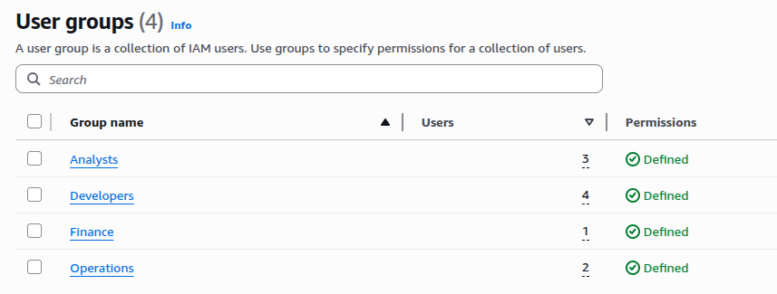
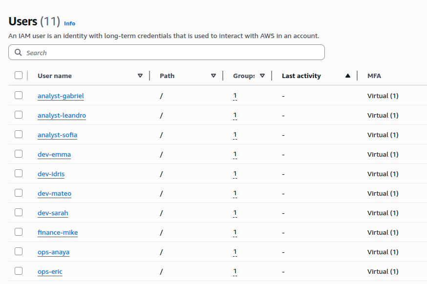
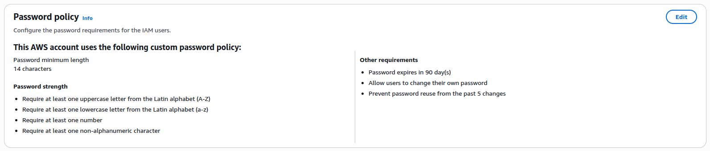
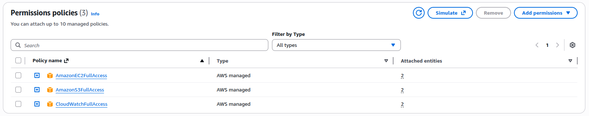
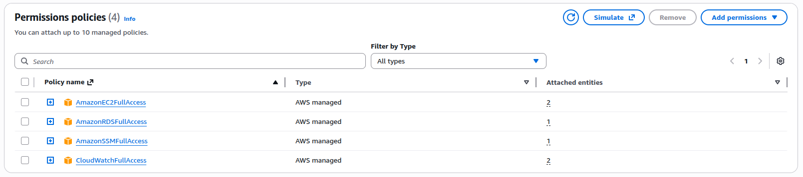
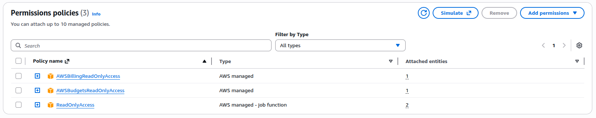
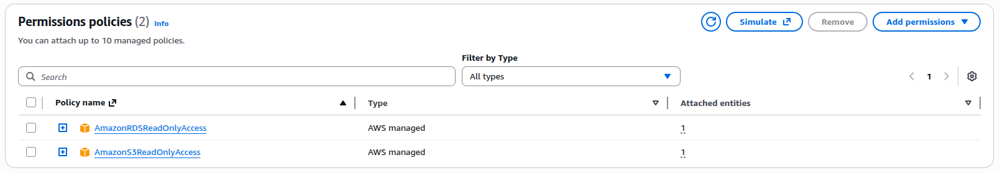
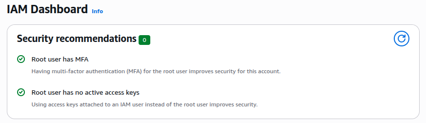

# Project 1: IAM Security Implementation for NexaTech

## Overview

This project demonstrates how I secured a startup's AWS environment by implementing proper Identity and Access Management (IAM) practices. The company was using a single root account for all 10 employees, which was a major security risk.

## The Problem

NexaTech, a fast-growing tech startup that recently launched their first product - a fitness tracking application had everyone sharing the root account credentials (passed around in team chat!). This meant:

- No way to track who was doing what in AWS
- Everyone had access to everything, including billing and the ability to delete resources
- If one person's credentials were compromised, the entire AWS account was at risk
- No multi-factor authentication protecting the account

**Current Infrastructure:**

- EC2 instances (web servers & application servers)
- S3 buckets (storing user data and app files)
- RDS database (user information)
- CloudWatch (monitoring)
- Development and Production environments

## My Solution

### 1. Secured the Root Account

- Enabled MFA using Google Authenticator
- Changed the password to something very strong
- Stored credentials in a secure password manager
- Documented that this account should only be used for emergencies or tasks that absolutely require root-level access, such as changing account settings or closing the AWS account

---

### 2. Created IAM Groups and Users

Instead of everyone sharing one account, I created individual accounts for each person and organised them into groups:

| Group      | Users | Purpose                      |
| ---------- | ----- | ---------------------------- |
| Developers | 4     | Build and deploy application |
| Operations | 2     | Manage infrastructure        |
| Finance    | 1     | Cost management              |
| Analysts   | 3     | Data analysis                |

This structure ensures that permissions are managed at the group level, making it easy to onboard new employees, adjust access as roles change, and maintain consistent security policies across the organisation.

---

### 3. Security Policies Implemented

I enforced strong password requirements and mandatory MFA for all user accounts to prevent unauthorised access and strengthen the company's security posture.

**Password Policy:**

- Minimum 14 characters
- Must include uppercase, lowercase, numbers, and symbols
- Passwords expires every 90 days
- Users cannot reuse last 5 passwords
- Users can change their own passwords

**MFA Enforcement:**

- Enabled MFA for each user
- This adds an extra layer of security even if passwords are stolen

---

### 4. Assigned Permissions (Principle of Least Privilege)

I gave each group only the permissions they need for their job:

**Developers:**

- Full access to EC2 (to deploy and manage the application)
- Full access to S3 (to upload and manage application files)
- Read-only access to CloudWatch (to view logs when troubleshooting)

**Operations:**

- Full access to EC2, RDS, CloudWatch, and Systems Manager
- They need this because they manage the entire infrastructure and are responsible for maintaining system health, performance, and availability. They need comprehensive access to troubleshoot issues, implement monitoring, and ensure the application runs smoothly.

This approach allows the finance manager to perform their cost analysis and budgeting responsibilities without the risk of accidentally impacting production systems.

**Finance:**

- Access to Cost Explorer and AWS Budgets
- Read-only access to see what resources are running (so they understand what infrastructure is running and correlate costs with specific services)
- They have no ability to actually create or delete resources

**Analysts:**

- Read-only access to S3 and RDS
- They can view and analyse data but can't update or delete data

This prevents accidental data deletion or modification while still allowing them to perform their analytical work.

## Security Decisions Explained

### ✅ Why I secured the root account

I locked down the root account because it has complete control over everything in AWS. If someone got access to it, they could delete the enitre comapnies infrastructure in minutes, rack up huge bills by spinning up expensive resources, or shut down the entire account. I enabled MFA and made sure it's only used for emergencies, not everyday tasks. This way, even if every other account gets compromised, NexaTech's core AWS account stays safe.

### ✅ Why I enforced MFA

I enabled MFA for every user because passwords alone aren't enough anymore. Even strong passwords can be stolen through phishing emails or data breaches. With MFA, an attacker would need both the password AND the person's phone, which makes it nearly impossible to break in.

### ✅ Why I chose group-based access

I used groups instead of giving permissions to individual users because it's much easier to manage. When a new developer joins, I just add them to the Developers group and they instantly get all the right permissions. If someone changes roles, I move them to a different group. This saves time and prevents mistakes from trying to set up each person manually.

### ✅ Why I implemented the principle of least privilege

I gave each group only what they need to do their job and nothing more. Developers can't see billing, Finance can't touch production servers, and Analysts can only read data, not change it. This way, if someone's account gets hacked, the damage is limited to just their area. It also prevents honest mistakes, like someone accidentally deleting something important they shouldn't have access to in the first place.

## What I Learned

- How to structure IAM for a real company, not just theoretical knowledge
- The importance of planning access based on job roles
- How to balance security with usability (people need to get their work done)
- That security is about layers - MFA + strong passwords + least privilege all work together

---

## Screenshots

### IAM Groups Structure

 
_The four groups created based on job roles_

### IAM Users

 
_All 10 users created and assigned to their respective groups_

### Password Policy

 
_Strong password requirements enforced_

### Developer Permissions

 
_Developers have access to EC2, S3, and CloudWatch logs_

### Operations Permissions

 
_Operations team has full infrastructure access_

### Finance Permissions

 
_Finance has billing access and read-only resource access_

### Analyst Permissions

 
_Analysts have read-only access to data resources_

### Root Account MFA

 
_Root account secured with multi-factor authentication_

## Technologies Used

- AWS IAM (Identity and Access Management)
- AWS MFA (Multi-Factor Authentication)
- AWS Managed Policies
